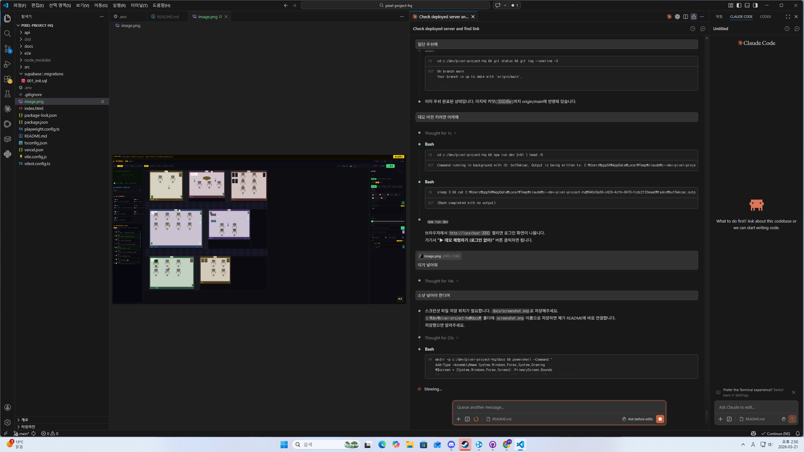

# Pixel HQ — AI Company God View Dashboard

> 픽셀아트 스타일의 AI 회사 프로젝트 관리 툴.
> 탑뷰로 회사 전체를 내려다보며 AI 직원들이 실시간으로 프로젝트를 처리한다.

[](./src)
[](./tsconfig.json)
[](https://pixel-project-hq.vercel.app)
[](./LICENSE)

**[▶ 라이브 데모](https://pixel-project-hq.vercel.app)** — 로그인 없이 즉시 체험

---



---

## 스크린샷

```
┌─────────────┬──────────────────────────────────┬──────────┐
│  사이드바   │          오피스 (탑뷰)            │  디테일  │
│             │                                  │  패널    │
│ 🚨 알림    │  [연구실]  [메인 오피스]           │          │
│ ⚠️ 경고    │  [서버실]  [CEO 오피스]            │ (클릭시) │
│ 📡 서버    │  [라운지]  [회의실]  [창고]        │          │
│ 🤖 에이전트│                                  │          │
│ 📜 로그    │  AI 직원들이 실시간으로 이동       │          │
└─────────────┴──────────────────────────────────┴──────────┘
```

---

## 주요 기능

| 기능 | 설명 |
|------|------|
| **God View** | 7개 방에서 프로젝트를 탑뷰로 관리, 클릭으로 선택 |
| **AI 직원 6명** | CEO·CTO·Lead·Senior·Junior·Assistant, 각자 성격과 AI 모델 보유 |
| **에이전트 채팅** | GPT-4o 기반 에이전트와 1:1 대화, 담당 프로젝트 컨텍스트 자동 주입 |
| **AI 어시스턴트** | 자연어로 프로젝트 추가·수정·삭제 (`"Pixel HQ 프로젝트 진행률 80으로 올려"`) |
| **서버 모니터링** | URL 등록 시 실시간 ping·uptime 체크 (Vercel Edge proxy) |
| **파일 드롭** | package.json / 텍스트 파일 드롭 → AI가 자동으로 프로젝트 파싱·등록 |
| **Company Feed** | Slack 스타일 채널 피드, AutoPilot 이벤트 자동 포스팅 |
| **Stats 대시보드** | KPI 카드, 마감 임박, 헬스 스코어 하위, 에이전트 현황 |
| **Kanban 뷰** | 상태별 보드 뷰 전환 |
| **Portfolio 뷰** | 포트폴리오용 카드 뷰 + JSON/HTML 익스포트 |
| **알림 연동** | Telegram Bot · Discord Webhook 알림 (방치/긴급 프로젝트) |
| **GitHub 연동** | 저장소 URL 등록 시 최근 커밋 자동 표시 |
| **AutoPilot** | 진행률 자동 업데이트, 서버 다운 감지, 태스크 자동 추가 |
| **실시간 동기화** | Supabase Realtime — 다기기 즉시 반영 |
| **데모 모드** | 로그인 없이 샘플 데이터로 전체 기능 체험 |

---

## 기술 스택

```
Frontend   React 18 + TypeScript (strict) + Vite
Styling    인라인 스타일 (Press Start 2P · DotGothic16 폰트)
Backend    Supabase (Auth + PostgreSQL + Realtime)
AI         OpenAI GPT-4o / GPT-4o-mini (Vercel Edge proxy)
배포       Vercel (Edge Functions: /api/openai, /api/ping)
테스트     Vitest + Testing Library (79 tests)
```

---

## 빠른 시작

```bash
git clone https://github.com/your-username/pixel-project-hq
cd pixel-project-hq
npm install
```

`.env` 파일 생성:

```env
VITE_SUPABASE_URL=https://your-project.supabase.co
VITE_SUPABASE_ANON_KEY=your-anon-key
OPENAI_API_KEY=sk-...        # 서버 전용 (브라우저에 노출 안됨)
```

```bash
npm run dev     # http://localhost:3000
npm test        # 79개 테스트
npm run build   # 프로덕션 빌드
```

> **Supabase 없이도 동작**: `.env`에 Supabase 설정이 없으면 localStorage 모드로 실행됩니다.

---

## Vercel 배포

1. Vercel에 저장소 연결
2. **Environment Variables** 추가:
   - `VITE_SUPABASE_URL` / `VITE_SUPABASE_ANON_KEY`
   - `OPENAI_API_KEY` ← **반드시 `VITE_` 없이** (서버 전용)
3. Deploy

---

## 프로젝트 구조

```
src/
├── components/         # UI 컴포넌트 (22개)
│   ├── OfficePlan      # 탑뷰 메인 오피스
│   ├── DetailPanel     # 우측 상세 패널
│   ├── AgentChat       # AI 에이전트 채팅
│   ├── CompanyFeed     # Slack 스타일 피드
│   ├── StatsView       # 통계 대시보드
│   └── ...
├── hooks/              # 커스텀 훅 (13개)
│   ├── useProjects     # CRUD + Supabase 동기화
│   ├── useAgents       # 에이전트 애니메이션
│   ├── useAIChat       # GPT-4o 채팅
│   ├── useAutoPilot    # 자동화 파일럿
│   ├── useServerStats  # 서버 ping 모니터링
│   └── ...
├── contexts/           # AuthContext, LogsContext
├── lib/                # supabase, db, openai
├── data/               # 에이전트·방 상수, 시드 데이터
├── utils/              # 보안, 헬스스코어, 헬퍼
└── types.ts            # 전체 타입 정의
api/
├── openai.ts           # Edge Function: OpenAI 프록시
└── ping.ts             # Edge Function: 서버 ping 프록시
```

---

## 라이선스

MIT
